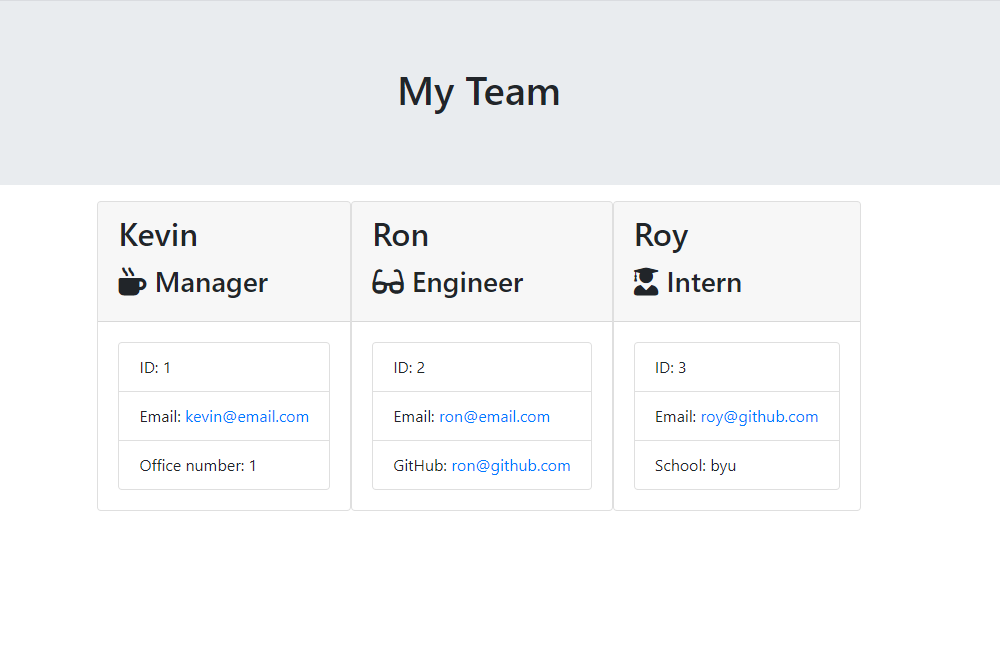

# Team Profile Generator 
  

  # Description
  
  A project that will take a managers input and create cards based on the employee type (engineer or intern). It will take their name and other pertinent information depending on which role they belong to.
  
  # Table of Contents
  
  * [Install](#install)
  
  * [Usage](#usage)
  
  * [Contributing](#contributing)
  
  * [Tests](#tests)
  
  * [Questions](#questions)

  * [Contact](#contact)
  
  ## Install
  
  Copy and paste 
  
  
      npm i
  
  
  ## Usage

  clone and update

  ## Contributing

  In order to contribute to this repo please **clone and update**
  
  ## Tests

  Copy and paste to run tests 

  
    npm test
  
  
  ## Questions
  Github: [@kjphelps90](https://github.com/kjphelps90?tab=repositories)

  Email: kjphelps90@gmail.com
  
  ## License
   Copyright 2021 Kevin

    Permission is hereby granted, free of charge, to any person obtaining a copy of this software and associated documentation files (the "Software"), to deal in the Software without restriction, including without limitation the rights to use, copy, modify, merge, publish, distribute, sublicense, and/or sell copies of the Software, and to permit persons to whom the Software is furnished to do so, subject to the following conditions:

    The above copyright notice and this permission notice shall be included in all copies or substantial portions of the Software.

    THE SOFTWARE IS PROVIDED "AS IS", WITHOUT WARRANTY OF ANY KIND, EXPRESS OR IMPLIED, INCLUDING BUT NOT LIMITED TO THE WARRANTIES OF MERCHANTABILITY, FITNESS FOR A PARTICULAR PURPOSE AND NONINFRINGEMENT. IN NO EVENT SHALL THE AUTHORS OR COPYRIGHT HOLDERS BE LIABLE FOR ANY CLAIM, DAMAGES OR OTHER LIABILITY, WHETHER IN AN ACTION OF CONTRACT, TORT OR OTHERWISE, ARISING FROM, OUT OF OR IN CONNECTION WITH THE SOFTWARE OR THE USE OR OTHER DEALINGS IN THE SOFTWARE.
  
